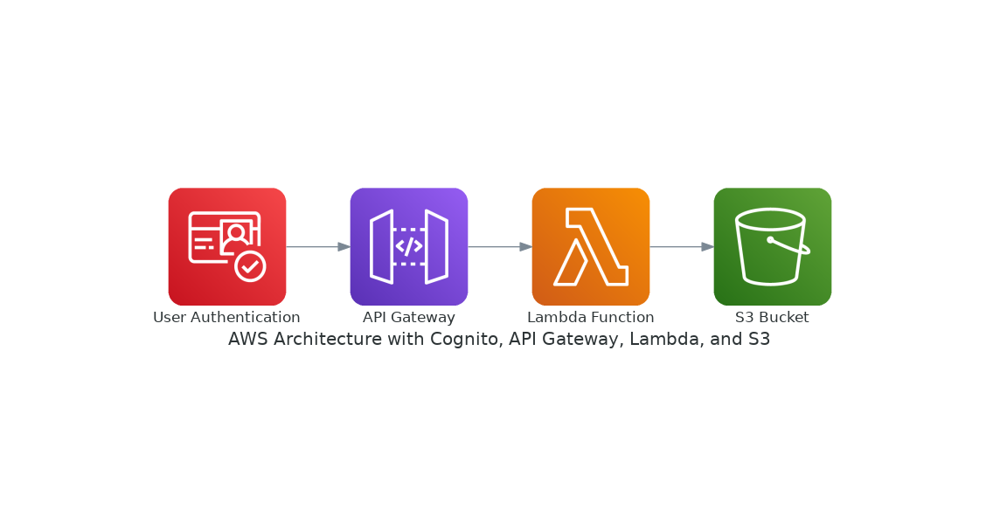

# Diagram-ai

This project delivers a robust, production-ready Flask API for automatically generating, validating, and explaining cloud architecture diagrams from natural language descriptions. Leveraging OpenAI's GPT-4o and the Python diagrams library, the API transforms user prompts into executable Python code, produces multi-format architecture diagrams (PNG, SVG, PDF, etc.), and generates concise technical explanations in both plain text and Markdown. The system features advanced error handling, code sanitization, and supports provider-specific (AWS, Azure, GCP) instructions. All outputs and logs are accessible via secure endpoints, making this solution ideal for integrating AI-powered diagram generation into developer tools, documentation workflows, or educational platforms.




## Quick Start (Docker)

### 1. Clone the repository
Clone this repository to your local machine:
```
git clone https://github.com/hamadkhawaja/diagram-ai.git
cd diagram-ai
```

### 2. Build the Docker image

```
docker build -t diagram-ai-api .
```

### 3. Run the Docker container
Replace `YOUR_OPENAI_API_KEY` with your actual OpenAI API key:
```
docker run -d \
  -e OPENAI_API_KEY=YOUR_OPENAI_API_KEY \
  -e S3_BUCKET=<UPLOAD_BUCKET_NAME> \
  -p 5000:5000 \
  --name diagram-ai-api \
  diagram-ai-api
```

- The API will be available at: http://localhost:5000


### 4. Test the API
See `API_USAGE.md` for endpoint documentation and example requests.

**Multi-format Output:**
The API now returns URLs for all available diagram formats (PNG, SVG, PDF, DOT, JPG) in the response. You can access any format using the provided URLs.

---

## Development (Local, without Docker)
1. Install Python 3.10+ and [pip](https://pip.pypa.io/en/stable/installation/).
2. (Recommended) Create and activate a virtual environment:
   ```
   python -m venv .venv
   source .venv/bin/activate
   ```
3. Install dependencies:
   ```
   pip install -r requirements.txt
   ```
4. Set your OpenAI API key as an environment variable:
   ```
   export OPENAI_API_KEY=YOUR_OPENAI_API_KEY
   ```
5. Set your S3 bucket name as an environment variable:
   ```
   export S3_BUCKET=<UPLOAD_BUCKET_NAME>
   ```

6. Run the app:
   ```
   python app.py
   ```

---

## Features
- **Diagram Generation**: Generate architecture diagrams from textual descriptions using OpenAI GPT-4o and the diagrams library.
- **Code Sanitization and Whitelisting**: Ensures generated code is safe and adheres to predefined rules.
- **Error Handling**: Logs errors and returns detailed JSON responses for debugging.
- **Static File Serving**: Serves generated diagrams via the `/diagrams/<filename>` endpoint.
- **Cloud Provider-Specific Instructions**: Supports AWS, Azure, and GCP-specific diagram generation using predefined instruction files.
- **Automatic Rewriting**: Input descriptions are automatically rewritten to use provider-specific terminology and best practices.
- **Multi-format Output**: All diagrams are available in PNG, SVG, PDF, DOT, and JPG formats.
- **Parallel Processing**: Explanation generation runs in parallel with diagram creation for improved performance.
- **Enhanced Azure Support**: Robust validation and correction of Azure module imports and class names.
- **In-memory Caching**: Caches LLM responses for rewrite and explain operations to improve response times.
- **S3 Integration**: Uploads all generated files to an S3 bucket for storage and retrieval.

## Key Features

1. **Natural Language to Diagram Generation**: Convert plain English descriptions into professional cloud architecture diagrams.

2. **Automatic Rewriting**: Input descriptions are automatically rewritten to use cloud provider-specific terminology and best practices before diagram generation.

3. **Multi-format Output**: All diagrams are available in PNG, SVG, PDF, DOT, and JPG formats.

4. **Intelligent Explanations**: Each diagram comes with an auto-generated technical explanation in plain text and Markdown.

5. **Optimized Performance**: Parallel processing for explanation generation and diagram creation, with in-memory caching for improved response times.

6. **S3 Integration**: All generated files are automatically uploaded to an S3 bucket for storage and retrieval.

## API Endpoints
### `/generate`
- **Method**: POST
- **Description**: Generates a diagram based on the provided description and cloud provider.
- **Request Body**:
  ```json
  {
    "description": "Your diagram description",
    "provider": "aws|azure|gcp"
  }
  ```
- **Response**:
  - Success: Returns the paths and URLs of the generated diagram in multiple formats, along with explanation.
  - Error: Returns an error message with details.

### `/rewrite`
- **Method**: POST
- **Description**: Rewrites a description to use provider-specific terminology and best practices.
- **Request Body**:
  ```json
  {
    "description": "Your diagram description",
    "provider": "aws|azure|gcp"
  }
  ```
- **Response**:
  - Success: Returns the rewritten description optimized for the specified provider.
  - Error: Returns an error message with details.

### `/explain`
- **Method**: POST
- **Description**: Generates an explanation for a diagram description.
- **Request Body**:
  ```json
  {
    "description": "Your diagram description",
    "provider": "aws|azure|gcp"
  }
  ```
- **Response**:
  - Success: Returns a technical explanation in plain text and Markdown formats.
  - Error: Returns an error message with details.

### `/diagrams/<filename>`
- **Method**: GET
- **Description**: Serves the generated diagram file.

### `/health`
- **Method**: GET
- **Description**: Health check endpoint for the API.

## Logging
- Logs are saved to `app.log` for debugging and monitoring purposes.

## Additional Notes
- Ensure the `diagrams/` folder is writable for saving generated diagrams.
- The application uses provider-specific instruction files for diagram generation, rewriting, and explanation.
- For AWS, Azure, and GCP specific diagrams, the API uses curated instruction files that are optimized for each cloud provider.
- All generated files are stored both locally and in the specified S3 bucket.

## Troubleshooting
- If you encounter issues with Docker builds, try rebuilding with `--no-cache`:
  ```
  docker build --no-cache -t mingrammer-diagram-api .
  ```
- For API usage and troubleshooting, see `API_USAGE.md`.

## License
MIT

## Environment Variables

- `OPENAI_API_KEY` – Your OpenAI API key (required)
- `S3_BUCKET` – The name of your S3 bucket for storing generated files (required)

For Docker, add the S3_BUCKET variable to your `docker run` command:
```
docker run -d \
  -e OPENAI_API_KEY=YOUR_OPENAI_API_KEY \
  -e S3_BUCKET=<UPLOAD_BUCKET_NAME> \
  -p 5000:5000 \
  --name diagram-ai-api \
  diagram-ai-api
```

## Optimizations

This project includes several optimizations to improve performance and reliability:

1. **In-memory Caching**: LLM responses for the `/rewrite` and `/explain` endpoints are cached to reduce API calls and improve response times.

2. **Parallel Processing**: Explanation generation runs in parallel with diagram code execution during the `/generate` operation to reduce overall response time.

3. **Azure Module Validation**: Enhanced validation and correction for Azure module imports and class names to minimize common errors in generated code.

4. **Efficient File Handling**: Python-based file transformations instead of subprocess calls for improved efficiency and reliability.

5. **Parallel S3 Uploads**: Multiple diagram formats are uploaded to S3 simultaneously to reduce wait time.

6. **Simplified Instructions**: Provider-specific instruction files have been simplified and optimized for better results from the LLM.

7. **Rewriting Before Generation**: All user inputs are rewritten with provider-specific terminology before being used for diagram generation, improving the quality of the output.
